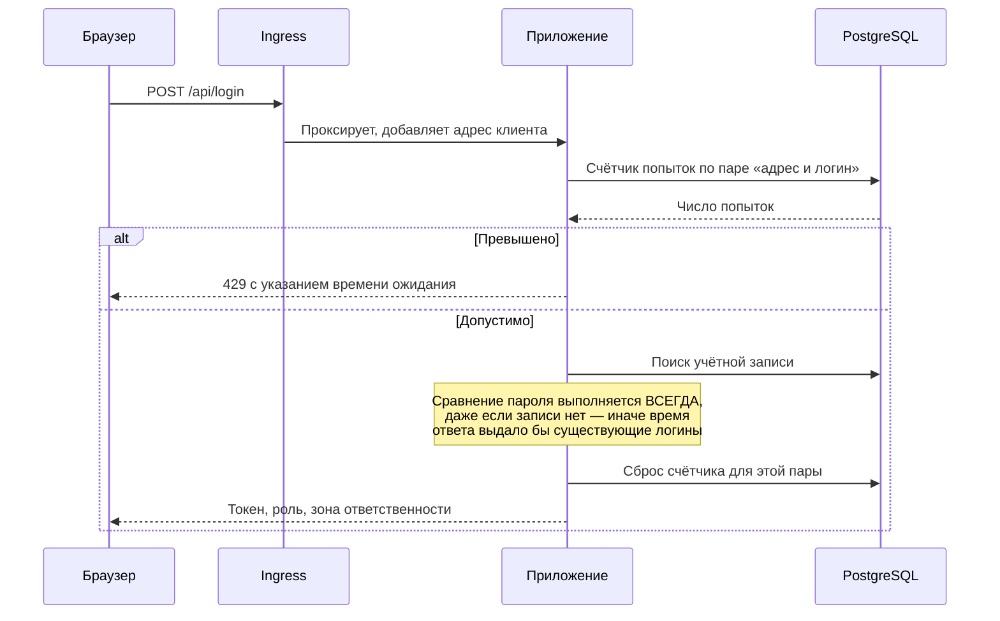
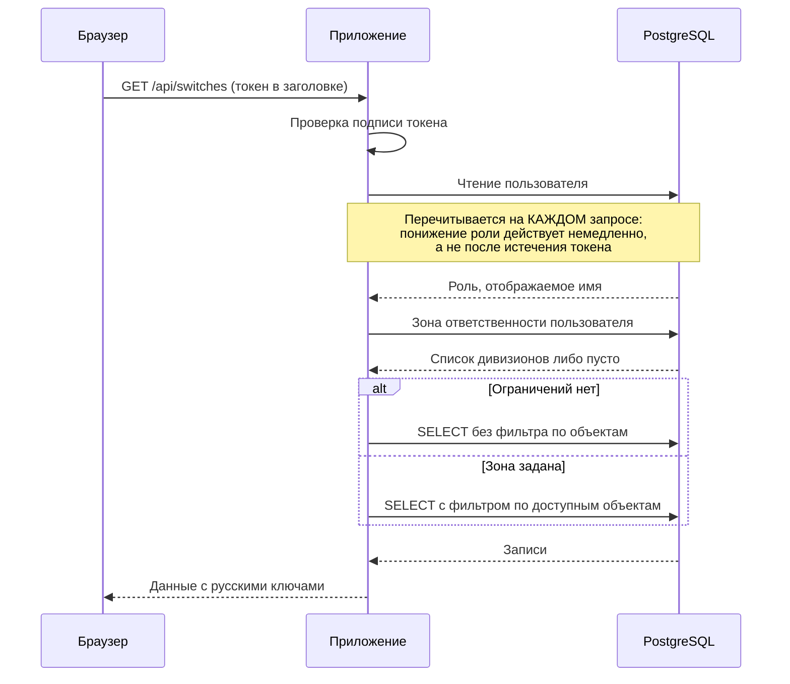
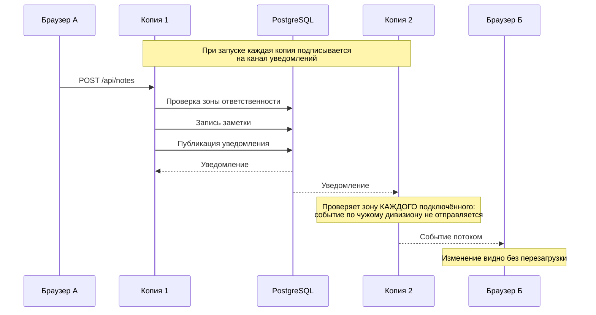
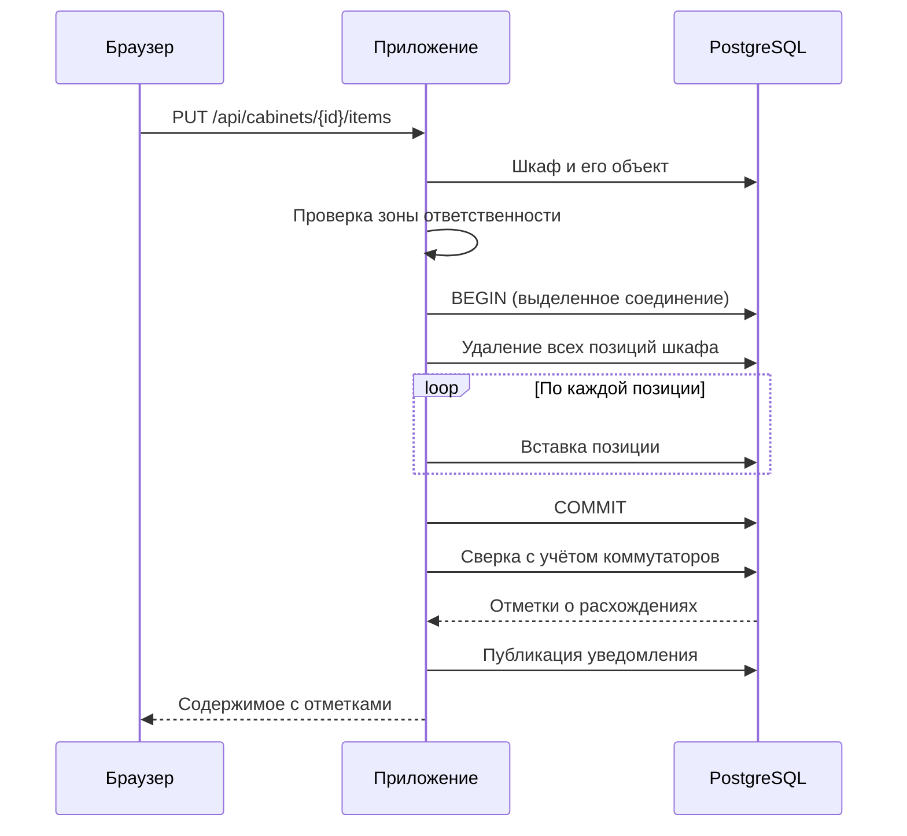
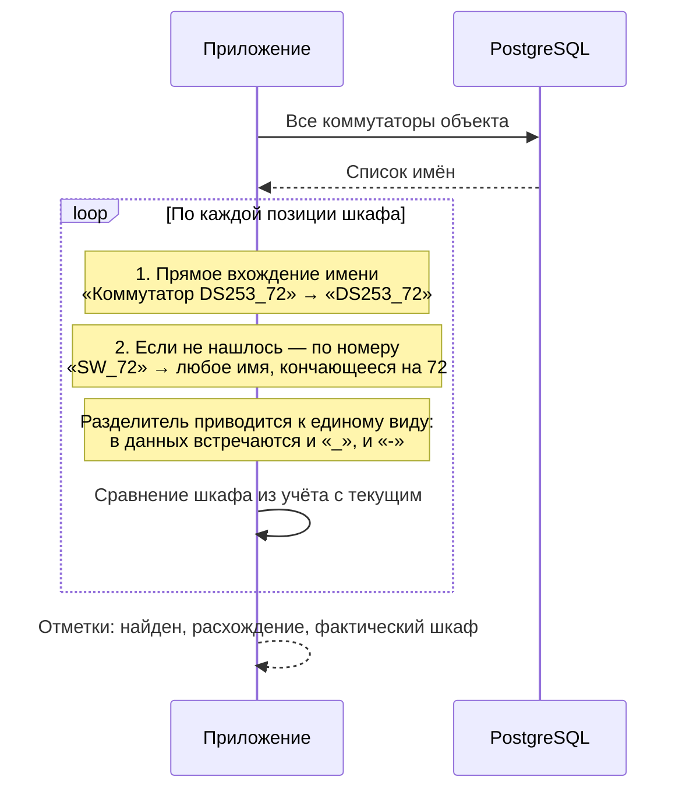
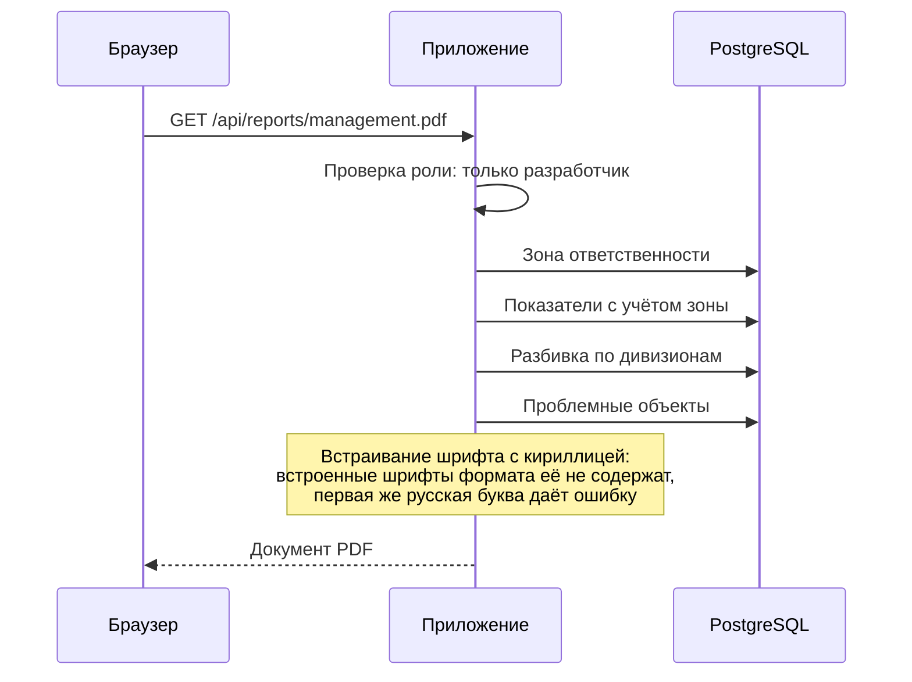
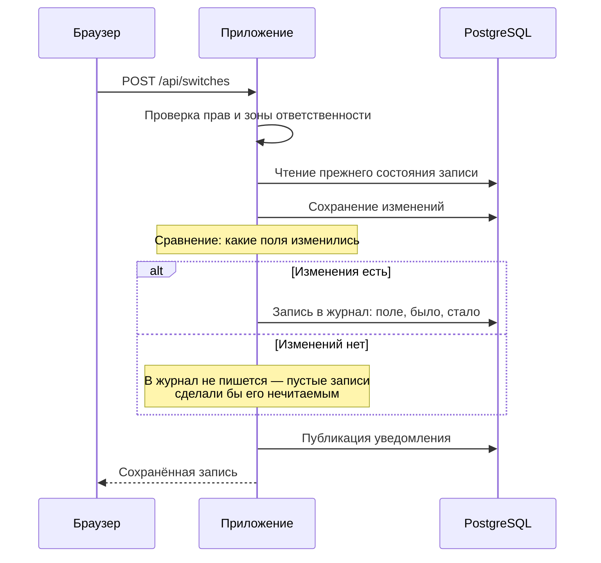
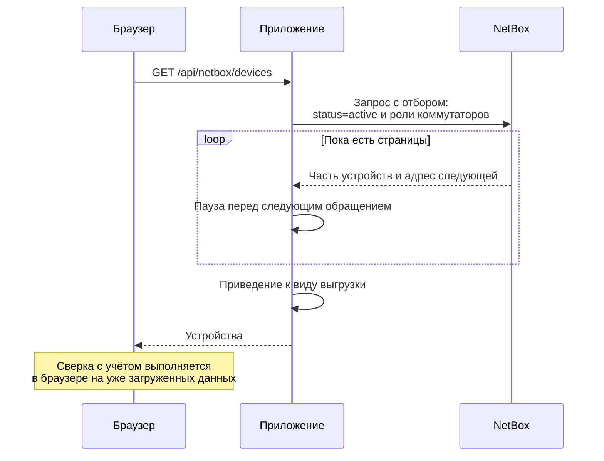

# Схема взаимодействия компонентов

Последовательность обмена для ключевых сценариев. Показаны те, где
логика неочевидна и где ошибка при доработке наиболее вероятна.

---

## 1. Вход в систему

**Ключевое:** счётчик ведётся по паре «адрес и логин». Если считать
только по адресу, ограничение обходится: имея одну действующую запись,
можно чередовать подбор чужого пароля с входом под своей.

---

## 2. Запрос данных с проверкой прав

**Ключевое:** ограничение применяется в самом запросе к базе, а не
фильтрацией результата. Отдать лишнее и отфильтровать потом означало бы,
что данные всё равно покидали хранилище.

---

## 3. Живые обновления между копиями приложения

**Почему через базу.** Соединения держит конкретная копия приложения.
Без общего канала пользователь на первой копии не увидел бы правок
того, кто попал на вторую. Отдельного посредника не потребовалось —
подошёл встроенный механизм уведомлений PostgreSQL.

**Зона проверяется при рассылке.** Иначе поток отдавал бы то, что
обычные запросы не отдают.

---

## 4. Сохранение содержимого шкафа

**Транзакция на выделенном соединении.** В пуле соединений отдельные
команды начала и завершения могут уйти в разные соединения — тогда
откат при ошибке не сработает, и шкаф остался бы наполовину пустым.

**Содержимое заменяется целиком.** Это отражает то, как заполняется
монтажный чертёж, но означает: при одновременном редактировании одного
шкафа двумя людьми второе сохранение затрёт первое. Известное
ограничение.

---

## 5. Сопоставление коммутатора со шкафом

**Почему поиск, а не сборка имени.** Собрать ожидаемое имя как
«объект и номер» нельзя: объект хранится без префикса, имя —
с префиксом, и угадывать его ненадёжно. Поэтому берутся все
коммутаторы объекта и сравнение идёт по вхождению.

**Почему не средствами базы.** Символ подчёркивания в шаблоне поиска
базы означает «любой один символ», и шаблон совпал бы с посторонними
именами. Сравнение выполняется в приложении.

---

## 6. Формирование отчёта

**Отчёт учитывает зону ответственности.** Руководитель дивизиона
получает документ только по своим объектам — отдельного действия
для этого не требуется.

---

## 7. Фиксация изменения в журнале

**Фиксируются только изменённые поля.** Запись строки целиком сделала
бы журнал непригодным для чтения: при разборе случая пришлось бы
сравнивать записи глазами.

**Сбой записи в журнал не отменяет операцию.** Если журнал недоступен,
действие всё равно выполняется, а причина попадает в вывод сервера:
потерять данные хуже, чем потерять запись о них.

---

## 8. Получение данных из NetBox

**Отбор выполняет NetBox**, а не приложение: устройства в других
состояниях не приходят вовсе. Иначе сверка показывала бы расхождения
по оборудованию, которого фактически нет в работе.

**Постраничный обход обязателен.** NetBox отдаёт устройства частями,
и без обхода до конца часть данных терялась бы молча.

**Обмен односторонний** — запись не выполняется по решению сетевого
отдела.

---

## Сводная таблица обмена

| Направление | Способ | Что передаётся |
|---|---|---|
| Браузер → Ingress | HTTPS | Запросы интерфейса и API |
| Ingress → Приложение | HTTP | Проксирование, адрес клиента в заголовке |
| Приложение → PostgreSQL | Протокол базы | Чтение и запись данных |
| Приложение → PostgreSQL | Уведомление | Публикация события об изменении |
| PostgreSQL → все копии | Подписка | Доставка события |
| Приложение → Браузер | Поток событий | Уведомление об изменении |
| Приложение → Keycloak | HTTPS | Проверка личности при входе |
| Приложение → NetBox | HTTPS | Выгрузка устройств, только чтение |
| Приложение → PostgreSQL | Протокол базы | Запись в журнал действий |
