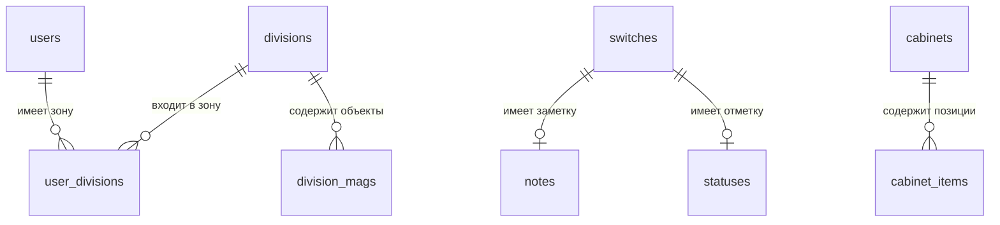

# Структура базы данных

PostgreSQL 13 или новее. Схема создаётся приложением автоматически
при первом запуске; описание в `database/01-schema.sql`.

---

## Обзор

| Таблица | Ключ | Назначение |
|---|---|---|
| `users` | `id`, уникальный `username` | Учётные записи |
| `user_divisions` | `username` + `div_name` | Зона ответственности |
| `switches` | `mag` + `sw` | Коммутаторы |
| `notes` | `mag` + `sw` | Заметки |
| `statuses` | `mag` + `sw` | Отметки «обработано» |
| `divisions` | `name` | Справочник дивизионов |
| `division_mags` | `div_name` + `mag` | Состав дивизионов |
| `cabinets` | `id` | Шкафы |
| `cabinet_items` | `id` | Наполнение шкафов |
| `oauth_states` | `state` | Состояние входа через поставщика |
| `login_attempts` | ключ попыток | Счётчик неудачных входов |
| `audit_log` | `id` | Журнал действий |

---

## Связи



**Связь между шкафами и коммутаторами объявлена не ключом, а сравнением
имён.** Причина: в шкафах оборудование записывается текстом, включая
то, что в учёте не ведётся — патч-панели, органайзеры, оптику. Жёсткая
связь потребовала бы заводить их все как записи.

---

## Таблицы

### `users` — учётные записи

| Поле | Тип | Пояснение |
|---|---|---|
| `id` | `SERIAL` | Первичный ключ |
| `username` | `TEXT` уникальный | Логин |
| `auth_provider` | `TEXT` | `local` — свой пароль, `external` — корпоративный вход |
| `password_hash` | `TEXT` | Необязателен: при внешнем входе отсутствует |
| `external_id` | `TEXT` уникальный | Постоянный идентификатор у поставщика |
| `display_name` | `TEXT` | Отображаемое имя |
| `role` | `TEXT` | `viewer`, `admin`, `developer` |
| `created_at` | `BIGINT` | Отметка времени в миллисекундах |
| `avatar` | `TEXT` | Изображение в текстовом виде |
| `yandex_uid` | `TEXT` | Второй фактор при собственном входе |

**Ограничение целостности:** у записи должен быть ровно один рабочий
способ входа — либо пароль, либо привязка к поставщику.

> **Идентификатор, а не логин.** Логин может измениться при смене
> фамилии или переводе. Постоянный идентификатор не меняется,
> и связь не теряется.

### `switches` — коммутаторы

| Поле | Пояснение |
|---|---|
| `mag` | Объект **без префикса**: `134`, не `MAG134` |
| `sw` | Имя **с префиксом**: `MAG134_70` |
| `shkaf` | Короткий код шкафа: `S3` |
| `ip`, `up`, `down_`, `location` | `down_` с подчёркиванием: `down` — служебное слово |
| `sn_netbox`, `sn_lyra`, `model` | Серийные номера и модель |
| `comment`, `comment_lyra` | Примечания |
| `updated_by`, `updated_by_name`, `updated_at` | Кто и когда менял |

Первичный ключ — пара «объект и имя». На этом построена загрузка:
повторная не создаёт дубли, а обновляет существующие.

**Разделитель непостоянен.** В данных встречаются `DS253_66`
и `DS253-67`. Сопоставление приводит обе стороны к единому виду.

### `cabinets` и `cabinet_items` — шкафы

| `cabinets` | Пояснение |
|---|---|
| `mag` | Объект без префикса |
| `name` | Полное наименование: «Шкаф коммутационный S1» |
| `characteristic` | Обычно высота: «22U» |
| `location` | Где стоит |

| `cabinet_items` | Пояснение |
|---|---|
| `cabinet_id` | Ссылка на шкаф |
| `unit` | Номер юнита, счёт снизу |
| `name` | Наименование оборудования |
| `comment` | Примечание |

**Сохранение заменяет содержимое целиком.** Отражает то, как
заполняется монтажный чертёж. Последствие: при одновременном
редактировании одного шкафа второе сохранение затрёт первое.

### `notes` и `statuses` — совместная работа

Обе привязаны к паре «объект и коммутатор». В `statuses` наличие
строки и есть отметка «обработано» — поле `done` всегда равно единице.

### `divisions` и `division_mags` — организационная структура

Справочник дивизионов и состав. От них зависит зона ответственности.

### `audit_log` — журнал действий

| Поле | Пояснение |
|---|---|
| `ts` | Отметка времени в миллисекундах |
| `username` | Кто. Для неудачных попыток входа — «аноним» |
| `action` | Что: тип события |
| `target` | Над чем: объект, коммутатор, учётная запись |
| `details` | Подробности: изменённые поля с прежними и новыми значениями |
| `ip` | С какого адреса |

**Фиксируемые события:**

| Тип | Когда |
|---|---|
| `login_corporate` | Вход через корпоративного поставщика |
| `login_local` | Служебный вход по паролю — отдельно, он для аварийных случаев |
| `login_failed` | Неудачная попытка |
| `user_role_change` | Изменение роли: было и стало |
| `user_scope_change` | Изменение зоны ответственности |
| `user_delete` | Удаление учётной записи |
| `switch_create`, `switch_update`, `switch_delete` | Изменения коммутаторов |
| `bulk_import` | Массовая загрузка |
| `cabinet_items_save`, `cabinets_import` | Изменения шкафов |
| `note_delete` | Удаление заметки |
| `audit_export` | Выгрузка журнала |

В подробностях фиксируются **только изменённые поля**, а не запись
целиком: иначе журнал пришлось бы читать глазами.

Просмотр и выгрузка доступны роли `developer` без ограничения по зоне
ответственности: записи содержат сведения о действиях всех
пользователей.

### `oauth_states` и `login_attempts` — служебные

Хранятся в базе, а не в памяти процесса: при нескольких копиях
приложения они должны быть общими.

**`oauth_states`** — состояние перехода к внешнему поставщику. Поле
`username` необязательно: при входе через корпоративного поставщика
пользователь неизвестен до возврата.

**`login_attempts`** — счётчик неудачных попыток. Ключ включает и адрес,
и логин: если считать только по адресу, ограничение обходится
чередованием подбора чужого пароля с входом под своей записью.

---

## Индексы

| Индекс | Зачем |
|---|---|
| `switches_mag_idx` | Коммутаторы объекта — самый частый запрос |
| `cabinets_mag_idx` | Шкафы объекта |
| `cabinet_items_cabinet_idx` | Содержимое шкафа — при каждом открытии |
| `division_mags_mag_idx` | Проверка зоны ответственности |
| `user_divisions_user_idx` | То же |
| `oauth_states_expires_idx` | Уборка устаревших записей |
| `login_attempts_reset_idx` | То же |
| `audit_log_ts_idx` | Журнал читается «последние действия» |
| `audit_log_user_idx` | Отбор по пользователю |

Файл `database/02-indexes.sql`.

---

## Ограничения целостности

Вынесены отдельно в `database/03-constraints.sql`: внешние ключи
и проверки допустимых значений.

> **Применять только после проверки данных** запросами из
> `04-check-before-constraints.sql`. Если в базе есть записи,
> ссылающиеся на несуществующие, команды завершатся ошибкой.

---

## Замечания по структуре

| Наблюдение | Оценка |
|---|---|
| Объект без префикса, имя с префиксом | Источник ошибок при доработке |
| Аватары в самой базе | Приемлемо при нынешнем числе пользователей |
| Отметки времени числом | Лишает встроенных средств работы с датами |
| `statuses.done` всегда единица | Поле фактически не используется |

Третья нормальная форма в основном соблюдена. Основной недостаток —
не структура, а то, что часть ограничений целостности не включена
по умолчанию.

---

## Резервное копирование

Приложение копии не создаёт — это задача инфраструктуры.

```bash
pg_dump -U switch_inventory -Fc switch_inventory > backup.dump
pg_restore -U switch_inventory -d switch_inventory --clean --if-exists < backup.dump
```
